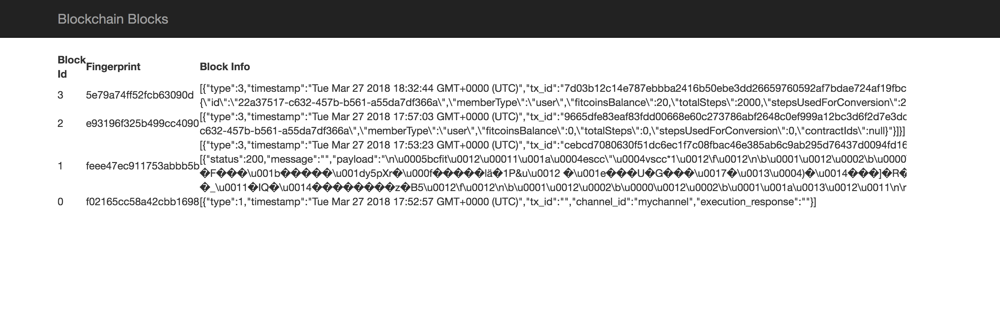

# 캐싱과 메시지 대기열을 활용하여 블록체인 네트워크 확장하기

*다른 언어로 보기: [English](README.md).*

이 단계에서는 아키텍처에서 Redis 및 RabbitMQ 클러스터를 구성하여 블록체인 네트워크로 들어오는 요청의 흐름을 제어합니다. REST API 호출을 직접 사용하면 블록체인 네트워크로 전송되는 요청 수를 제어할 수 없어서 읽기/쓰기 충돌 등의 오류가 발생할 수 있습니다. 블록체인 네트워크로 전송되는 요청의 흐름을 제어하고 애플리케이션을 확장하기 위해, 우리는 3개 노드의 RabbitMQ 클러스터에 미러링된 대기열(Queue)를 구성하여 사용자 요청을 쌓습니다. 그리고 6개의 노드(마스터 3개와 슬레이브 3개)로 구성된 Redis 클러스터에 실행 결과를 잠깐 동안 저장할 수 있게 합니다. 아키텍처 다이어그램처럼 API 컨테이너의 RabbitMQ 생성자(producer)는 요청을 RabbitMQ 클러스터의 대기열에 보내고, Fabric-Node-SDK 인스턴스로 작성된 작업 실행 컨테이너(Task Execution Container)의 RabbitMQ 소비자(consumer)는 대기열에 쌓인 사용자의 요청을 블록체인 네트워크에 보냅니다.

Redis 설정코드 참조 `./backend/utils/util.js`

RabbitMQ 설정코드 참조 `./rabbitClient/utils/util.js`

## 포함된 구성요소
* Hyperledger Fabric
* Docker
* Hyperledger Fabric SDK for node.js

## 애플리케이션 흐름도


1. `git clone https://github.com/IBM/Leveraging-cache-and-MessagingQueue-to-scale-BlockchainNetwork.git` 명령을 실행하여 Git 저장소를 복제합니다.
2. `build.sh` 명령으로 네트워크를 설정합니다.

## 사전 준비
* [Docker](https://www.docker.com/products/overview) - v1.13 or higher
* [Docker Compose](https://docs.docker.com/compose/overview/) - v1.8 or higher

## 순서
1. [Build.sh를 실행하여 빌드하고 네트워크를 구동](#1-buildsh-스크립트-실행)
2. [로그에서 결과 확인](#2-로그-확인)
3. [블록체인 네트워크 테스트](#3-블록체인-네트워크-테스트)


## 1. Build.sh 스크립트 실행
아래의 순서를 수행합니다:

a. 기존에 존재하는 블록체인 도커(Docker) 이미지를 삭제하여 시스템을 정리합니다.

b. 증명서를 발급합니다.

  * `crypto-config.yaml`(암호 설정파일)은 각 Peer와 Orderer가 어느 조직과 도메인에 속하는지 정의합니다.

c. Peer, Orderer, Channel을 생성합니다.

  * `configtx.yaml` 파일은 체인의 첫 블록인 Orderer 제네시스 블럭을 생성하여 블록체인 네트워크나 채널을 시작합니다. 그리고 각 채널 피어에 멤버십 서비스를 설치합니다(이 경우엔 Shop 과 Fitcoin 피어).
  
d. Orderer, Peer, Channel, Network의 도커 이미지를 생성합니다.

## 새 터미널을 열어 다음 명령어 실행합니다.
```bash
export FABRIC_CFG_PATH=$(pwd)
chmod +x cryptogen
chmod +x configtxgen
chmod +x generate-certs.sh
chmod +x generate-cfgtx.sh
chmod +x docker-images.sh
chmod +x build.sh
chmod +x clean.sh
./build.sh
```


## 2. 로그 확인

**명령어**
```bash
docker logs blockchain-setup
```
**결과:**
```bash
CA registration complete
CA registration complete
Default channel not found, attempting creation...
Successfully created a new default channel.
Joining peers to the default channel.
Chaincode is not installed, attempting installation...
Base container image present.
info: [packager/Golang.js]: packaging GOLANG from bcfit
info: [packager/Golang.js]: packaging GOLANG from bcfit
Successfully installed chaincode on the default channel.
Successfully instantiated chaincode on all peers.
Blockchain newtork setup complete.
```

**명령어**
```bash
docker ps
```
**결과:**
```bash
f4ddfcb1e4d8        haproxy:1.7                                                                              "/docker-entrypoint.…"   5 minutes ago       Up 5 minutes        0.0.0.0:3000->3000/tcp                                rabbitclient
5f40495511f1        backend                                                                                  "node index.js"          5 minutes ago       Up 5 minutes                                                              fitcoin_fitcoin-backend_1
6ea304c78c40        backend                                                                                  "node index.js"          5 minutes ago       Up 5 minutes        0.0.0.0:3030->3030/tcp                                fitcoin_shop-backend_1
ef481c334532        rabbit-client                                                                            "node index.js"          5 minutes ago       Up 5 minutes        0.0.0.0:3003->3000/tcp                                rabbitclient3
51b7c6cee311        rabbit-client                                                                            "node index.js"          5 minutes ago       Up 5 minutes        0.0.0.0:3002->3000/tcp                                rabbitclient2
1195c7cb43ca        rabbit-client                                                                            "node index.js"          5 minutes ago       Up 5 minutes        0.0.0.0:3001->3000/tcp                                rabbitclient1
15533fe3a151        redis-server                                                                             "/docker-entrypoint.…"   5 minutes ago       Up 5 minutes        6379/tcp, 0.0.0.0:7000-7005->7000-7005/tcp            fitcoin_redis-server_1
556840abfc4d        dev-shop-peer-bcfit-1-0e0d4e71de9ac7df4d0d20dfcf583e3e63227edda600fe338485053387e09c50   "chaincode -peer.add…"   6 minutes ago       Up 6 minutes                                                              dev-shop-peer-bcfit-1
8c594ddc16f4        haproxy:1.7                                                                              "/docker-entrypoint.…"   6 minutes ago       Up 6 minutes        0.0.0.0:5672->5672/tcp, 0.0.0.0:15672->15672/tcp      rabbitmq
c59da84a4e7c        rabbitmq:3-management                                                                    "/usr/local/bin/clus…"   6 minutes ago       Up 6 minutes        4369/tcp, 5671-5672/tcp, 15671-15672/tcp, 25672/tcp   rabbitmq2
f07024afd0f1        rabbitmq:3-management                                                                    "/usr/local/bin/clus…"   6 minutes ago       Up 6 minutes        4369/tcp, 5671-5672/tcp, 15671-15672/tcp, 25672/tcp   rabbitmq3
7ef2085afd54        rabbitmq:3-management                                                                    "docker-entrypoint.s…"   6 minutes ago       Up 6 minutes        4369/tcp, 5671-5672/tcp, 15671-15672/tcp, 25672/tcp   rabbitmq1
2a775a81c967        blockchain-setup                                                                         "node index.js"          7 minutes ago       Up 7 minutes        3000/tcp                                              blockchain-setup
90136f4c90fe        fitcoin-peer                                                                             "peer node start"        7 minutes ago       Up 7 minutes        0.0.0.0:8051->7051/tcp, 0.0.0.0:8053->7053/tcp        fitcoin-peer
19e4890f71e3        shop-peer                                                                                "peer node start"        7 minutes ago       Up 7 minutes        0.0.0.0:7051->7051/tcp, 0.0.0.0:7053->7053/tcp        shop-peer
654ada9fbbf6        ishangulhane/fabric-couchdb                                                              "tini -- /docker-ent…"   7 minutes ago       Up 7 minutes        4369/tcp, 9100/tcp, 0.0.0.0:9984->5984/tcp            shop-statedb
b19022ef3b2a        ishangulhane/fabric-couchdb                                                              "tini -- /docker-ent…"   7 minutes ago       Up 7 minutes        4369/tcp, 9100/tcp, 0.0.0.0:5984->5984/tcp            ca-datastore
6360ff012bbd        fitcoin-ca                                                                               "fabric-ca-server st…"   7 minutes ago       Up 7 minutes        0.0.0.0:8054->7054/tcp                                fitcoin-ca
9d06dd0a009d        orderer-peer                                                                             "orderer"                7 minutes ago       Up 7 minutes        0.0.0.0:7050->7050/tcp                                orderer0
0de13cd1ba31        shop-ca                                                                                  "fabric-ca-server st…"   7 minutes ago       Up 7 minutes        0.0.0.0:7054->7054/tcp                                shop-ca
9dba93e63b5c        ishangulhane/fabric-couchdb                                                              "tini -- /docker-ent…"   7 minutes ago       Up 7 minutes        4369/tcp, 9100/tcp, 0.0.0.0:8984->5984/tcp            fitcoin-statedb
```

**명령어**
```bash
docker logs fitcoin_fitcoin-backend_1
```
**결과:**
```
CA registration complete
CA registration complete
CA registration complete
[x] Awaiting RPC requests on clientClient0
[x] Awaiting RPC requests on clientClient2
[x] Awaiting RPC requests on clientClient1
```

**명령어**
```bash
docker logs fitcoin_shop-backend_1
```
**결과:**
```
CA registration complete
CA registration complete
Starting socker server
[x] Awaiting RPC requests on clientClient0
```

## 3. 블록체인 네트워크 테스트

다른 터미널에서 testApplication 폴더로 이동하고 다음 명령을 실행합니다
```
npm install
node index.js
```
다음 URL에 접속하여 블록체인 블록을 확인합니다. **http://localhost:8000/history.html**



이제는 다음 URL에서 블록체인 명령을 수행합니다. **http://localhost:8000/test.html**

>참고 : 이 애플리케이션에서는 사용자 대기열(User Queue)에는 다음 중 하나의 값을 입력할 수 있습니다 : user_queue 또는 seller_queue

**사용자 등록 요청 예제**


**조회(Query) 요청 예제**


**반영(Invoke) 요청 예제**


## 추가 자료

* [Hyperledger Fabric Docs](http://hyperledger-fabric.readthedocs.io/en/latest/)
* [Hyperledger Composer Docs](https://hyperledger.github.io/composer/introduction/introduction.html)

## 라이센스
[Apache 2.0](LICENSE)
