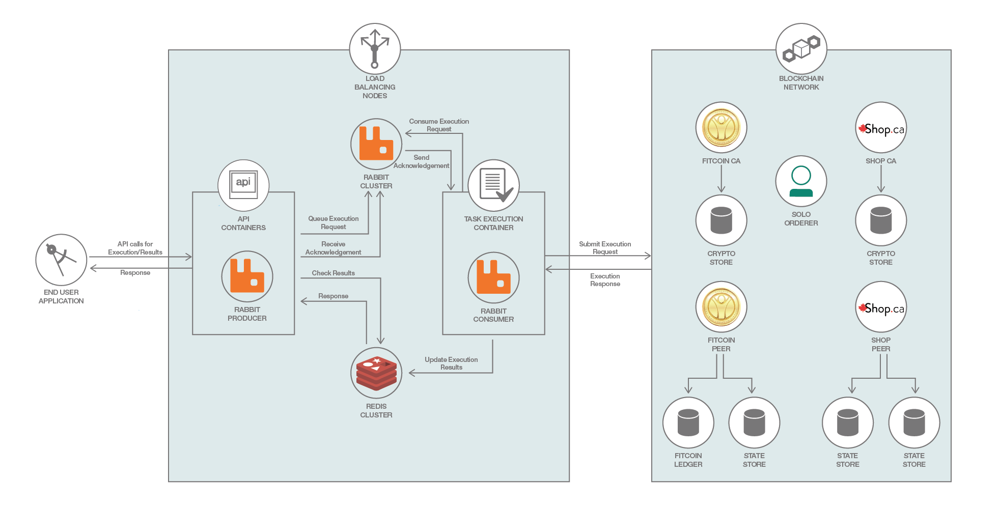
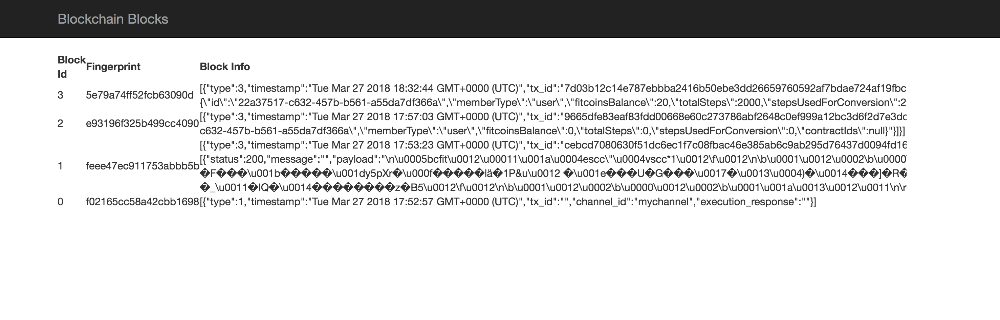
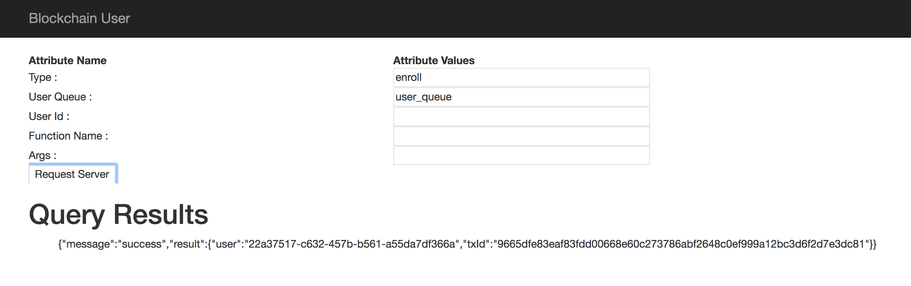
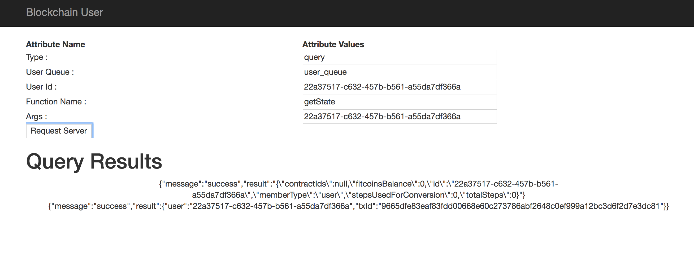
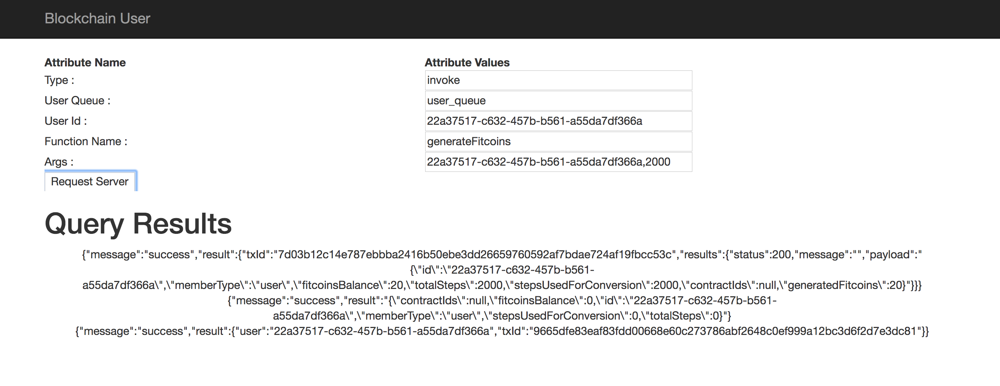

# Leveraging the Cache and Messaging Queue to Scale a Blockchain Network

*Read this in other languages: [한국어](README-ko.md).*

In this step, we will configure Redis and RabbitMQ cluster in our architecture to control the flow of incoming request to blockchain network. With the direct use of REST API calls, it is not possible to control the number of requests sent to blockchain network, this might cause errors such as read/write conflicts etc. In order to control the flow of request sent to blockchain network and scale our application, we will use RabbitMQ cluster with 3 nodes consisting of mirrored queues to queue the user requests and Redis cluster with 6 nodes (3 master and 3 slaves) where results of execution are store for a short duration. In architecture diagram, we have RabbitMQ producer present in API containers that queue the requests to RabbitMQ cluster and RabbitMQ consumers configured with an instance of Fabric-Node-SDK in Task execution containers to consume the requests from users and send it blockchain network for execution.

You will find the configuration code for Redis in `./backend/utils/util.js`.

You will find the configuration code for RabbitMQ in `./rabbitClient/utils/util.js`

## Included Components
* Hyperledger Fabric
* Docker
* Hyperledger Fabric SDK for node.js


## Application Workflow Diagram


1. Issue a `git clone https://github.com/IBM/Leveraging-cache-and-MessagingQueue-to-scale-BlockchainNetwork.git`.
2. Issue the command `build.sh` to setup the network.

## Prerequisites
* [Docker](https://www.docker.com/products/overview) - v1.13 or higher
* [Docker Compose](https://docs.docker.com/compose/overview/) - v1.8 or higher

## Steps
1. [Run Build.sh Script to build  and start the network](#1-run-the-build.sh-script)
2. [Check the logs to see the results](#2-check-the-logs)
3. [Test the Blockchain Network](#3-test-the-blockchainnetwork)

## 1. Run the Build.sh Script
This accomplishes the following:

a. Clean up system by removing any existing blockchain docker images

b. Generate certificates

  * The `crypto-config.yaml` (Crypto configuration file) defines the identity of "who is who". It tells peers and orderers what organization they belown to and what domain they belong to.

c.  Create Peers, Orderers and Channel

  * The `configtx.yaml` file initializes a blockchain network or channel and services with an Orderer Genesis Block which serves as the first block on a chain. Additionally, membership services are installed on each channel peer (in this case, the Shop and Fitcoin Peers).

d. Build docker images of the orderer, peers, channel, network

### Open a new terminal and run the following command:
```bash
export FABRIC_CFG_PATH=$(pwd)
chmod +x cryptogen
chmod +x configtxgen
chmod +x generate-certs.sh
chmod +x generate-cfgtx.sh
chmod +x docker-images.sh
chmod +x build.sh
chmod +x clean.sh
./build.sh
```

## 2. Check the logs

**Command**
```bash
docker logs blockchain-setup
```
**Output:**
```bash
CA registration complete
CA registration complete
Default channel not found, attempting creation...
Successfully created a new default channel.
Joining peers to the default channel.
Chaincode is not installed, attempting installation...
Base container image present.
info: [packager/Golang.js]: packaging GOLANG from bcfit
info: [packager/Golang.js]: packaging GOLANG from bcfit
Successfully installed chaincode on the default channel.
Successfully instantiated chaincode on all peers.
Blockchain newtork setup complete.
```

**Command**
```bash
docker ps
```
**Output:**
```bash
f4ddfcb1e4d8        haproxy:1.7                                                                              "/docker-entrypoint.…"   5 minutes ago       Up 5 minutes        0.0.0.0:3000->3000/tcp                                rabbitclient
5f40495511f1        backend                                                                                  "node index.js"          5 minutes ago       Up 5 minutes                                                              fitcoin_fitcoin-backend_1
6ea304c78c40        backend                                                                                  "node index.js"          5 minutes ago       Up 5 minutes        0.0.0.0:3030->3030/tcp                                fitcoin_shop-backend_1
ef481c334532        rabbit-client                                                                            "node index.js"          5 minutes ago       Up 5 minutes        0.0.0.0:3003->3000/tcp                                rabbitclient3
51b7c6cee311        rabbit-client                                                                            "node index.js"          5 minutes ago       Up 5 minutes        0.0.0.0:3002->3000/tcp                                rabbitclient2
1195c7cb43ca        rabbit-client                                                                            "node index.js"          5 minutes ago       Up 5 minutes        0.0.0.0:3001->3000/tcp                                rabbitclient1
15533fe3a151        redis-server                                                                             "/docker-entrypoint.…"   5 minutes ago       Up 5 minutes        6379/tcp, 0.0.0.0:7000-7005->7000-7005/tcp            fitcoin_redis-server_1
556840abfc4d        dev-shop-peer-bcfit-1-0e0d4e71de9ac7df4d0d20dfcf583e3e63227edda600fe338485053387e09c50   "chaincode -peer.add…"   6 minutes ago       Up 6 minutes                                                              dev-shop-peer-bcfit-1
8c594ddc16f4        haproxy:1.7                                                                              "/docker-entrypoint.…"   6 minutes ago       Up 6 minutes        0.0.0.0:5672->5672/tcp, 0.0.0.0:15672->15672/tcp      rabbitmq
c59da84a4e7c        rabbitmq:3-management                                                                    "/usr/local/bin/clus…"   6 minutes ago       Up 6 minutes        4369/tcp, 5671-5672/tcp, 15671-15672/tcp, 25672/tcp   rabbitmq2
f07024afd0f1        rabbitmq:3-management                                                                    "/usr/local/bin/clus…"   6 minutes ago       Up 6 minutes        4369/tcp, 5671-5672/tcp, 15671-15672/tcp, 25672/tcp   rabbitmq3
7ef2085afd54        rabbitmq:3-management                                                                    "docker-entrypoint.s…"   6 minutes ago       Up 6 minutes        4369/tcp, 5671-5672/tcp, 15671-15672/tcp, 25672/tcp   rabbitmq1
2a775a81c967        blockchain-setup                                                                         "node index.js"          7 minutes ago       Up 7 minutes        3000/tcp                                              blockchain-setup
90136f4c90fe        fitcoin-peer                                                                             "peer node start"        7 minutes ago       Up 7 minutes        0.0.0.0:8051->7051/tcp, 0.0.0.0:8053->7053/tcp        fitcoin-peer
19e4890f71e3        shop-peer                                                                                "peer node start"        7 minutes ago       Up 7 minutes        0.0.0.0:7051->7051/tcp, 0.0.0.0:7053->7053/tcp        shop-peer
654ada9fbbf6        ishangulhane/fabric-couchdb                                                              "tini -- /docker-ent…"   7 minutes ago       Up 7 minutes        4369/tcp, 9100/tcp, 0.0.0.0:9984->5984/tcp            shop-statedb
b19022ef3b2a        ishangulhane/fabric-couchdb                                                              "tini -- /docker-ent…"   7 minutes ago       Up 7 minutes        4369/tcp, 9100/tcp, 0.0.0.0:5984->5984/tcp            ca-datastore
6360ff012bbd        fitcoin-ca                                                                               "fabric-ca-server st…"   7 minutes ago       Up 7 minutes        0.0.0.0:8054->7054/tcp                                fitcoin-ca
9d06dd0a009d        orderer-peer                                                                             "orderer"                7 minutes ago       Up 7 minutes        0.0.0.0:7050->7050/tcp                                orderer0
0de13cd1ba31        shop-ca                                                                                  "fabric-ca-server st…"   7 minutes ago       Up 7 minutes        0.0.0.0:7054->7054/tcp                                shop-ca
9dba93e63b5c        ishangulhane/fabric-couchdb                                                              "tini -- /docker-ent…"   7 minutes ago       Up 7 minutes        4369/tcp, 9100/tcp, 0.0.0.0:8984->5984/tcp            fitcoin-statedb
```

**Command**
```bash
docker logs fitcoin_fitcoin-backend_1
```
**Output:**
```
CA registration complete
CA registration complete
CA registration complete
[x] Awaiting RPC requests on clientClient0
[x] Awaiting RPC requests on clientClient2
[x] Awaiting RPC requests on clientClient1
```

**Command**
```bash
docker logs fitcoin_shop-backend_1
```
**Output:**
```
CA registration complete
CA registration complete
Starting socker server
[x] Awaiting RPC requests on clientClient0
```

## 3. Test the BlockchainNetwork

In a separate terminal navigate to testApplication folder and run the following command:
```
npm install
node index.js
```
Navigate to url to view the blockchain blocks: **http://localhost:8000/history.html**



Now navigate to url to perform operations on network : **http://localhost:8000/test.html**

>Note : For this application the user queue value can be either : user_queue or seller_queue

**Sample Enroll User request**



**Sample Query request**



**Sample Invoke request**



## Additional Resources

* [Hyperledger Fabric Docs](http://hyperledger-fabric.readthedocs.io/en/latest/)
* [Hyperledger Composer Docs](https://hyperledger.github.io/composer/introduction/introduction.html)

## License
This code pattern is licensed under the Apache Software License, Version 2.  Separate third party code objects invoked within this code pattern are licensed by their respective providers pursuant to their own separate licenses. Contributions are subject to the [Developer Certificate of Origin, Version 1.1 (DCO)](https://developercertificate.org/) and the [Apache Software License, Version 2](http://www.apache.org/licenses/LICENSE-2.0.txt).

[Apache Software License (ASL) FAQ](http://www.apache.org/foundation/license-faq.html#WhatDoesItMEAN)

